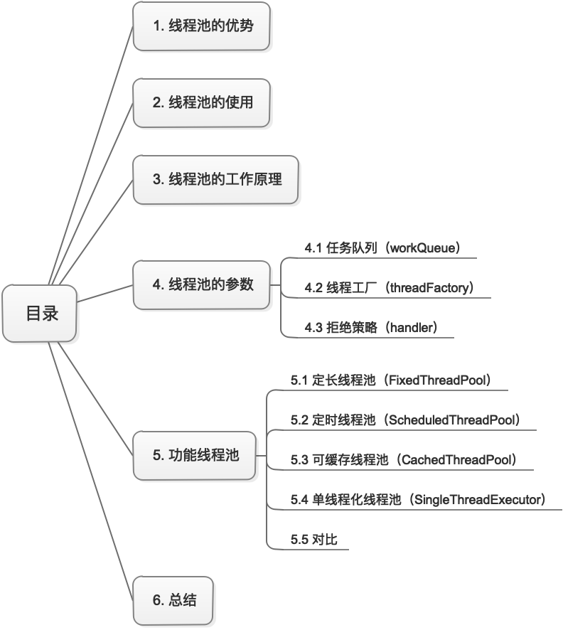
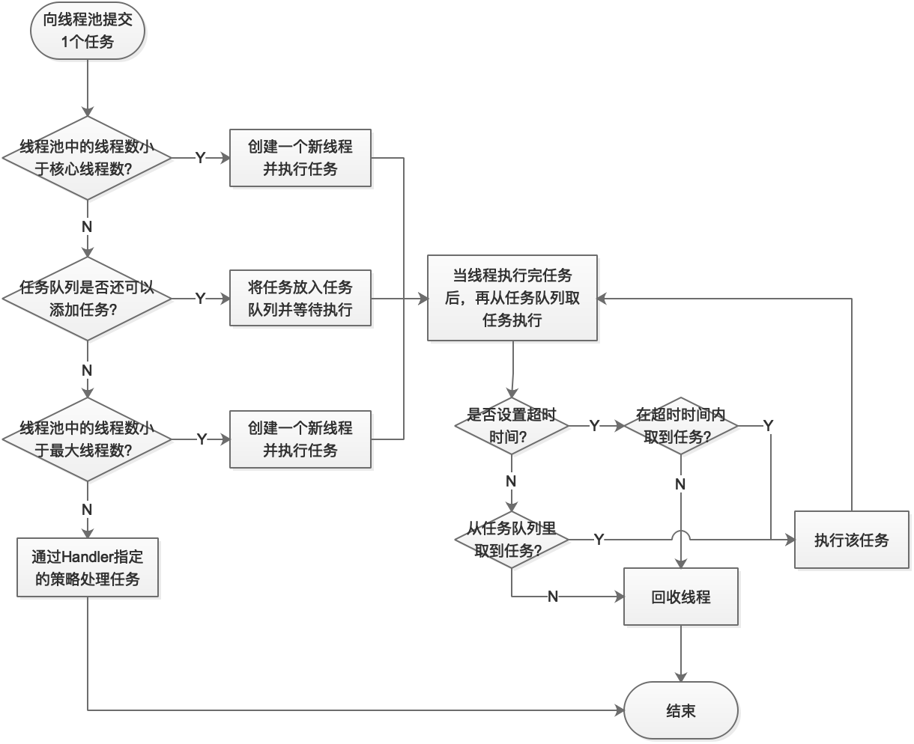
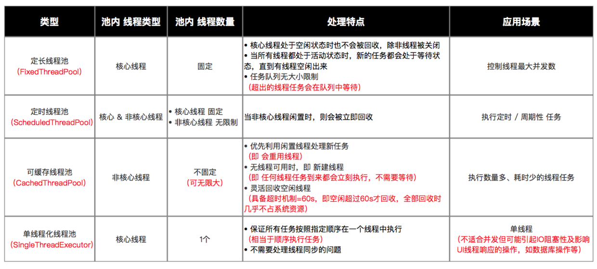

# Java多线程：彻底搞懂线程池

当我们线程创建过多时,容易引发内存溢出,就有必要使用线程池的技术.




## 1 线程池的优势

总体来说，线程池有如下的优势： 

（1）**降低资源消耗**。通过重复利用已创建的线程降低线程创建和销毁造成的消耗。 

（2）**提高响应速度**。当任务到达时，任务可以不需要等到线程创建就能立即执行。 

（3）**提高线程的可管理性**。线程是稀缺资源，如果无限制的创建，不仅会消耗系统资源，还会降低系统的稳定性，使用线程池可以进行统一的分配，调优和监控。


## 2 线程池的使用

线程池的真正实现类是`ThreadPoolExecutor`，其构造方法有如下4种：

```java
public ThreadPoolExecutor(int corePoolSize,
                          int maximumPoolSize,
                          long keepAliveTime,
                          TimeUnit unit,
                          BlockingQueue<Runnable> workQueue) {
    this(corePoolSize, maximumPoolSize, keepAliveTime, unit, workQueue,
         Executors.defaultThreadFactory(), defaultHandler);
}

public ThreadPoolExecutor(int corePoolSize,
                          int maximumPoolSize,
                          long keepAliveTime,
                          TimeUnit unit,
                          BlockingQueue<Runnable> workQueue,
                          ThreadFactory threadFactory) {
    this(corePoolSize, maximumPoolSize, keepAliveTime, unit, workQueue,
         threadFactory, defaultHandler);
}

public ThreadPoolExecutor(int corePoolSize,
                          int maximumPoolSize,
                          long keepAliveTime,
                          TimeUnit unit,
                          BlockingQueue<Runnable> workQueue,
                          RejectedExecutionHandler handler) {
    this(corePoolSize, maximumPoolSize, keepAliveTime, unit, workQueue,
         Executors.defaultThreadFactory(), handler);
}

public ThreadPoolExecutor(int corePoolSize,
                          int maximumPoolSize,
                          long keepAliveTime,
                          TimeUnit unit,
                          BlockingQueue<Runnable> workQueue,
                          ThreadFactory threadFactory,
                          RejectedExecutionHandler handler) {
    if (corePoolSize < 0 ||
        maximumPoolSize <= 0 ||
        maximumPoolSize < corePoolSize ||
        keepAliveTime < 0)
        throw new IllegalArgumentException();
    if (workQueue == null || threadFactory == null || handler == null)
        throw new NullPointerException();
    this.corePoolSize = corePoolSize;
    this.maximumPoolSize = maximumPoolSize;
    this.workQueue = workQueue;
    this.keepAliveTime = unit.toNanos(keepAliveTime);
    this.threadFactory = threadFactory;
    this.handler = handler;
}
```

可以看到，其需要如下几个参数：

- **corePoolSize**（必需）：核心线程数。默认情况下，核心线程会一直存活，但是当将`allowCoreThreadTimeout`设置为true时，核心线程也会超时回收。

- **maximumPoolSize**（必需）：线程池所能容纳的最大线程数。当活跃线程数达到该数值后，后续的新任务将会阻塞。

- **keepAliveTime**（必需）：线程闲置超时时长。如果超过该时长，非核心线程就会被回收。如果将`allowCoreThreadTimeout`设置为true时，核心线程也会超时回收。

- **unit**（必需）：指定keepAliveTime参数的时间单位。常用的有：`TimeUnit.MILLISECONDS`（毫秒）、`TimeUnit.SECONDS`（秒）、`TimeUnit.MINUTES`（分）。

- **workQueue**（必需）：任务队列。通过线程池的execute()方法提交的Runnable对象将存储在该参数中。

- **threadFactory**（可选）：线程工厂。用于指定为线程池创建新线程的方式。

- **handler**（可选）：拒绝策略。当达到最大线程数时需要执行的饱和策略。

线程池的使用流程如下：

```java
// 创建线程池
Executor threadPool = new ThreadPoolExecutor(CORE_POOL_SIZE,
                                             MAXIMUM_POOL_SIZE,
                                             KEEP_ALIVE,
                                             TimeUnit.SECONDS,
                                             sPoolWorkQueue,
                                             sThreadFactory);
// 向线程池提交任务
threadPool.execute(new Runnable() {
    @Override
    public void run() {
        ... // 线程执行的任务
    }
});
// 关闭线程池
threadPool.shutdown(); // 设置线程池的状态为SHUTDOWN，然后中断所有没有正在执行任务的线程
threadPool.shutdownNow(); // 设置线程池的状态为 STOP，然后尝试停止所有的正在执行或暂停任务的线程，并返回等待执行任务的列表
```


## 3 线程池的工作原理

下面来描述一下线程池工作的原理，同时对上面的参数有一个更深的了解。其工作原理流程图如下：



通过上图，相信大家已经对所有参数有个了解了。其实还有一点，在线程池中并没有区分线程是否是核心线程的。下面我们再对任务队列、线程工厂和拒绝策略做更多的说明。


## 4 线程池的参数

### 4.1 任务队列（workQueue）

任务队列是基于阻塞队列实现的，即采用生产者消费者模式，在Java中需要实现`BlockingQueue`接口。但Java已经为我们提供了7种阻塞队列的实现：

1. **ArrayBlockingQueue**：一个由数组结构组成的有界阻塞队列（数组结构可配合指针实现一个环形队列）。
2. **LinkedBlockingQueue**： 一个由链表结构组成的有界阻塞队列，在未指明容量时，容量默认为`Integer.MAX_VALUE`。
3. **PriorityBlockingQueue**： 一个支持优先级排序的无界阻塞队列，对元素没有要求，可以实现`Comparable`接口也可以提供Comparator来对队列中的元素进行比较。跟时间没有任何关系，仅仅是按照优先级取任务。
4. **DelayQueue**：类似于`PriorityBlockingQueue`，是二叉堆实现的无界优先级阻塞队列。要求元素都实现`Delayed`接口，通过执行时延从队列中提取任务，时间没到任务取不出来。
5. **SynchronousQueue**： 一个不存储元素的阻塞队列，消费者线程调用take()方法的时候就会发生阻塞，直到有一个生产者线程生产了一个元素，消费者线程就可以拿到这个元素并返回；生产者线程调用put()方法的时候也会发生阻塞，直到有一个消费者线程消费了一个元素，生产者才会返回。
6. **LinkedBlockingDeque**： 使用双向队列实现的有界双端阻塞队列。双端意味着可以像普通队列一样FIFO（先进先出），也可以像栈一样FILO（先进后出）。
7. **LinkedTransferQueue**： 它是`ConcurrentLinkedQueue`、`LinkedBlockingQueue`和`SynchronousQueue`的结合体，但是把它用在ThreadPoolExecutor中，和`LinkedBlockingQueue`行为一致，但是是无界的阻塞队列。

***注意有界队列和无界队列的区别：如果使用有界队列，当队列饱和时并超过最大线程数时就会执行拒绝策略；而如果使用无界队列，因为任务队列永远都可以添加任务，所以设置`maximumPoolSize`没有任何意义。***


### 4.2 线程工厂（threadFactory）

线程工厂指定创建线程的方式，需要实现`ThreadFactory`接口，并实现`newThread(Runnable r)`方法。该参数可以不用指定，Executors框架已经为我们实现了一个默认的线程工厂：

```java
/**
 * The default thread factory.
 */
private static class DefaultThreadFactory implements ThreadFactory {
    private static final AtomicInteger poolNumber = new AtomicInteger(1);
    private final ThreadGroup group;
    private final AtomicInteger threadNumber = new AtomicInteger(1);
    private final String namePrefix;

    DefaultThreadFactory() {
        SecurityManager s = System.getSecurityManager();
        group = (s != null) ? s.getThreadGroup() :
                              Thread.currentThread().getThreadGroup();
        namePrefix = "pool-" +
                      poolNumber.getAndIncrement() +
                     "-thread-";
    }

    public Thread newThread(Runnable r) {
        Thread t = new Thread(group, r,
                              namePrefix + threadNumber.getAndIncrement(),
                              0);
        if (t.isDaemon())
            t.setDaemon(false);
        if (t.getPriority() != Thread.NORM_PRIORITY)
            t.setPriority(Thread.NORM_PRIORITY);
        return t;
    }
}
```


### 4.3 拒绝策略（handler）

当线程池的线程数达到最大线程数时，需要执行拒绝策略。拒绝策略需要实现`RejectedExecutionHandler`接口，并实现`rejectedExecution(Runnable r, ThreadPoolExecutor executor)`方法。不过Executors框架已经为我们实现了4种拒绝策略：

1. **AbortPolicy（默认）**：丢弃任务并抛出`RejectedExecutionException`异常。
2. **CallerRunsPolicy**：由调用线程处理该任务。
3. **DiscardPolicy**：丢弃任务，但是不抛出异常。可以配合这种模式进行自定义的处理方式。
4. **DiscardOldestPolicy**：丢弃队列最早的未处理任务，然后重新尝试执行任务。


## 5 功能线程池

嫌上面使用线程池的方法太麻烦？其实Executors已经为我们封装好了4种常见的功能线程池，如下：

- 定长线程池（FixedThreadPool）
- 定时线程池（ScheduledThreadPool ）
- 可缓存线程池（CachedThreadPool）
- 单线程化线程池（SingleThreadExecutor）


### 5.1 定长线程池（FixedThreadPool）

创建方法的源码：

```java
public static ExecutorService newFixedThreadPool(int nThreads) {
    return new ThreadPoolExecutor(nThreads, nThreads,
                                  0L, TimeUnit.MILLISECONDS,
                                  new LinkedBlockingQueue<Runnable>());
}
public static ExecutorService newFixedThreadPool(int nThreads, ThreadFactory threadFactory) {
    return new ThreadPoolExecutor(nThreads, nThreads,
                                  0L, TimeUnit.MILLISECONDS,
                                  new LinkedBlockingQueue<Runnable>(),
                                  threadFactory);
}
```

- **特点**：只有核心线程，线程数量固定，执行完立即回收，任务队列为链表结构的有界队列。
- **应用场景**：控制线程最大并发数。

使用示例：

```java
// 1. 创建定长线程池对象 & 设置线程池线程数量固定为3
ExecutorService fixedThreadPool = Executors.newFixedThreadPool(3);
// 2. 创建好Runnable类线程对象 & 需执行的任务
Runnable task =new Runnable(){
  public void run() {
     System.out.println("执行任务啦");
  }
};
// 3. 向线程池提交任务
fixedThreadPool.execute(task);
```


### 5.2 定时线程池（ScheduledThreadPool ）

创建方法的源码：

```java
private static final long DEFAULT_KEEPALIVE_MILLIS = 10L;

public static ScheduledExecutorService newScheduledThreadPool(int corePoolSize) {
    return new ScheduledThreadPoolExecutor(corePoolSize);
}
public ScheduledThreadPoolExecutor(int corePoolSize) {
    super(corePoolSize, Integer.MAX_VALUE,
          DEFAULT_KEEPALIVE_MILLIS, MILLISECONDS,
          new DelayedWorkQueue());
}

public static ScheduledExecutorService newScheduledThreadPool(
        int corePoolSize, ThreadFactory threadFactory) {
    return new ScheduledThreadPoolExecutor(corePoolSize, threadFactory);
}
public ScheduledThreadPoolExecutor(int corePoolSize,
                                   ThreadFactory threadFactory) {
    super(corePoolSize, Integer.MAX_VALUE,
          DEFAULT_KEEPALIVE_MILLIS, MILLISECONDS,
          new DelayedWorkQueue(), threadFactory);
}
```

- **特点**：核心线程数量固定，非核心线程数量无限，执行完闲置10ms后回收，任务队列为延时阻塞队列。
- **应用场景**：执行定时或周期性的任务。

使用示例：

```java
// 1. 创建 定时线程池对象 & 设置线程池线程数量固定为5
ScheduledExecutorService scheduledThreadPool = Executors.newScheduledThreadPool(5);
// 2. 创建好Runnable类线程对象 & 需执行的任务
Runnable task =new Runnable(){
  public void run() {
     System.out.println("执行任务啦");
  }
};
// 3. 向线程池提交任务
scheduledThreadPool.schedule(task, 1, TimeUnit.SECONDS); // 延迟1s后执行任务
scheduledThreadPool.scheduleAtFixedRate(task,10,1000,TimeUnit.MILLISECONDS);// 延迟10ms后、每隔1000ms执行任务

```


## 5.3 可缓存线程池（CachedThreadPool）

创建方法的源码：

```java
public static ExecutorService newCachedThreadPool() {
    return new ThreadPoolExecutor(0, Integer.MAX_VALUE,
                                  60L, TimeUnit.SECONDS,
                                  new SynchronousQueue<Runnable>());
}
public static ExecutorService newCachedThreadPool(ThreadFactory threadFactory) {
    return new ThreadPoolExecutor(0, Integer.MAX_VALUE,
                                  60L, TimeUnit.SECONDS,
                                  new SynchronousQueue<Runnable>(),
                                  threadFactory);
}
```

- **特点**：无核心线程，非核心线程数量无限，执行完闲置60s后回收，任务队列为不存储元素的阻塞队列。
- **应用场景**：执行大量、耗时少的任务。

使用示例：

```java
// 1. 创建可缓存线程池对象
ExecutorService cachedThreadPool = Executors.newCachedThreadPool();
// 2. 创建好Runnable类线程对象 & 需执行的任务
Runnable task =new Runnable(){
  public void run() {
     System.out.println("执行任务啦");
  }
};
// 3. 向线程池提交任务
cachedThreadPool.execute(task);

```


### 5.4 单线程化线程池（SingleThreadExecutor）

创建方法的源码：

```java
public static ExecutorService newSingleThreadExecutor() {
    return new FinalizableDelegatedExecutorService
        (new ThreadPoolExecutor(1, 1,
                                0L, TimeUnit.MILLISECONDS,
                                new LinkedBlockingQueue<Runnable>()));
}
public static ExecutorService newSingleThreadExecutor(ThreadFactory threadFactory) {
    return new FinalizableDelegatedExecutorService
        (new ThreadPoolExecutor(1, 1,
                                0L, TimeUnit.MILLISECONDS,
                                new LinkedBlockingQueue<Runnable>(),
                                threadFactory));
}
```

- **特点**：只有1个核心线程，无非核心线程，执行完立即回收，任务队列为链表结构的有界队列。
- **应用场景**：不适合并发但可能引起IO阻塞性及影响UI线程响应的操作，如数据库操作、文件操作等。

使用示例：

```java
// 1. 创建单线程化线程池
ExecutorService singleThreadExecutor = Executors.newSingleThreadExecutor();
// 2. 创建好Runnable类线程对象 & 需执行的任务
Runnable task =new Runnable(){
  public void run() {
     System.out.println("执行任务啦");
  }
};
// 3. 向线程池提交任务
singleThreadExecutor.execute(task);
```


### 5.5 对比




## 6 总结

Executors的4个功能线程池虽然方便，但现在已经不建议使用了，而是建议直接通过使用ThreadPoolExecutor的方式，这样的处理方式让写的同学更加明确线程池的运行规则，规避资源耗尽的风险。

其实Executors的4个功能线程有如下弊端：

- `FixedThreadPool`和`SingleThreadExecutor`：主要问题是堆积的请求处理队列均采用`LinkedBlockingQueue`，可能会耗费非常大的内存，甚至OOM(内存泄露或内存溢出)。

- `CachedThreadPool`和`ScheduledThreadPool`：主要问题是线程数最大数是`Integer.MAX_VALUE`，可能会创建数量非常多的线程，甚至OOM(内存泄露或内存溢出)。


**Update:**

阿里巴巴开发手册不建议直接使用Executor来创建线程池,建议通过使用ThreadPoolExecutor的方式:

XXXXXXXXExecutorService executorService = new XXXXXXXXThreadPoolExecutor(参数YYYYYYYY.................);