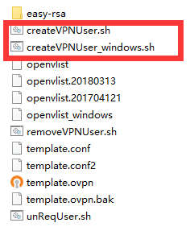
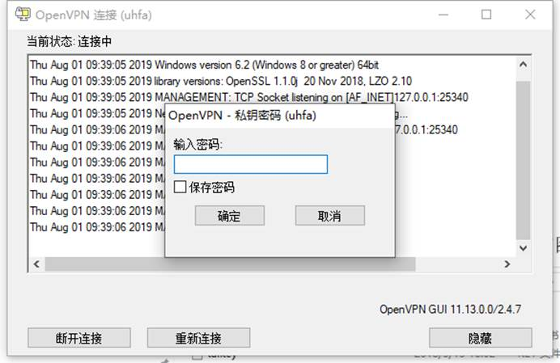

## 一、  服务端

服务端配置与证书生成

略过

。。。。。。

 

把公网服务器（134.175.210.57）的ca.crt复制到本地的linux操作，或直接在57服务器上实现也可以。Openvpn在57上的路径为/etc/openvpn，在里面可找到ca.crt与相关的服务器证书, ca.crt密码为openvpn20180313GBp2Nr。在57上有编写好sh脚本直接可生成客户端证书，sh名称如下图：

也可以使用第二章节（客户端）的生成方式实现。

公网上服务器的启动指令：openvpn --cd /etc/openvpn --daemon --config server.conf

## 二、  客户端

为了便于区别，我们把客户端使用的证书存放在新的路径。/etc/openvpn/client

### 1.   创建客户端证书

[root@localhost client]# mkdir -p /etc/openvpn/client

[root@localhost client]# cd /etc/openvpn/client

[root@localhost client]# cp -r /usr/share/easy-rsa/3.0.3/* /etc/openvpn/client

[root@localhost client]# cp /usr/share/doc/easy-rsa-3.0.3/vars.example ./vars

[root@localhost client]# ./easyrsa init-pki

[root@localhost client]# ./easyrsa gen-req client nopass  #client为证书名，可自定义，nopass同样设置免密

Generating a 2048 bit RSA private key

.....................................................+++

.................................+++

writing new private key to '/etc/openvpn/client/pki/private/client.key.0rbEXauafe'

\-----

You are about to be asked to enter information that will be incorporated

into your certificate request.

What you are about to enter is what is called a Distinguished Name or a DN.

There are quite a few fields but you can leave some blank

For some fields there will be a default value,

If you enter '.', the field will be left blank.

\-----

Common Name (eg: your user, host, or server name) [client]:

 

Keypair and certificate request completed. Your files are:

req: /etc/openvpn/client/pki/reqs/client.req

key: /etc/openvpn/client/pki/private/client.key        #key路径

 

### 2.   对客户端证书签名、签约

\#切换到服务端easy-rsa目录下：

cd /etc/openvpn/easy-rsa

\#导入req

./easyrsa import-req /etc/openvpn/client/pki/reqs/client.req client

./easyrsa sign client client     #签名,第一个client是固定的参数表示客户端，第二个client指上面导入的客户端证书名

./easyrsa sign client client

Note: using Easy-RSA configuration from: ./vars

 

 

You are about to sign the following certificate.

Please check over the details shown below for accuracy. Note that this request

has not been cryptographically verified. Please be sure it came from a trusted

source or that you have verified the request checksum with the sender.

 

Request subject, to be signed as a client certificate for 3650 days:

 

subject=

  commonName        = client

 

 

Type the word 'yes' to continue, or any other input to abort.

 Confirm request details: yes                  #输入'yes'

Using configuration from ./openssl-1.0.cnf

Enter pass phrase for /etc/openvpn/easy-rsa/pki/private/ca.key:  #输入ca密码（123456）

Check that the request matches the signature

Signature ok

The Subject's Distinguished Name is as follows

commonName      :PRINTABLE:'client'

Certificate is to be certified until Apr 13 14:37:17 2028 GMT (3650 days)

 

Write out database with 1 new entries

Data Base Updated

 

Certificate created at: /etc/openvpn/easy-rsa/pki/issued/client.crt   #最终客户端证书路径

### 3.   配置客户端的配置文件(windows客户端)

打开配置文件，录入以下内容。

client

;dev tap

dev tun

;dev-node MyTap

;proto tcp

proto tcp

remote 134.175.210.57 9088 

;remote my-server-2 1194

;remote-random

resolv-retry infinite

nobind

;user nobody

;group nobody

persist-key

persist-tun

;mute-replay-warnings

ca ca.crt

cert uhfa.crt

key uhfa.key

remote-cert-tls server

tls-auth ta.key 1

cipher AES-256-CBC

verb 3

;mute 20

把证书和配置文件放到openvpn客户端配置目录，如下图。

启动openvpn客户端，如下图。

录入客户端证书密码登录就可以。